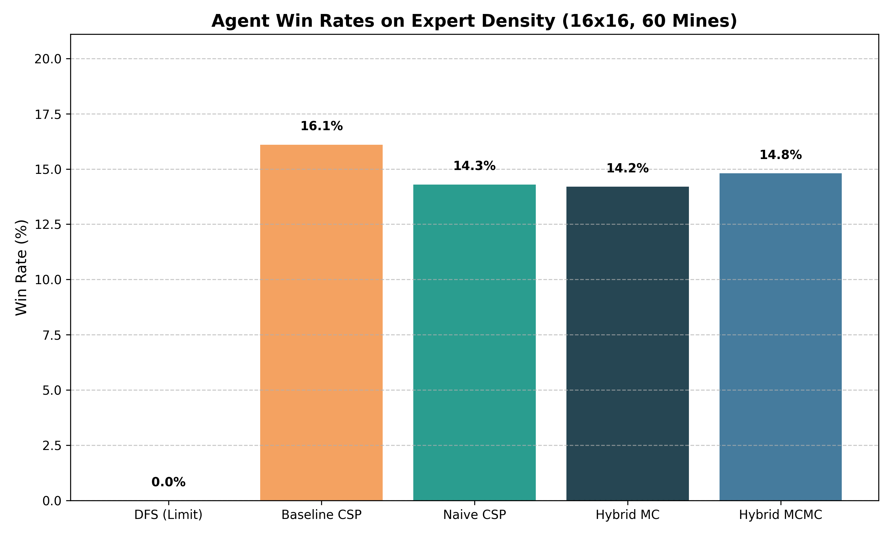
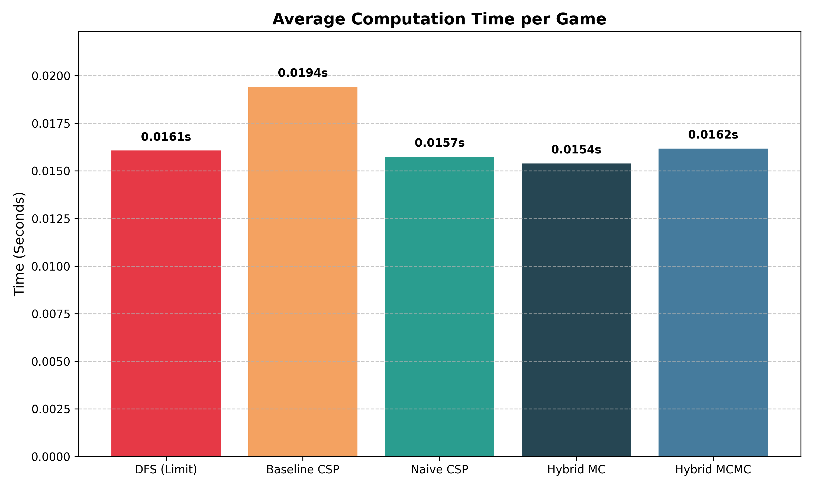
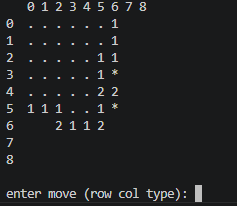

# Minesweeper Agent using Constraint Satisfaction and Probabilistic Inference

## 1 Introduction

Decision-making under uncertainty is a core problem in Artificial Intelligence. Unlike games with perfect information, such as Chess or Go, Minesweeper presents a partially observable environment. The internal state of the board is completely hidden at initialization. An intelligent agent must determine the state of these hidden cells based solely on limited information provided by numerical clues from previous moves. This project develops an AI agent that combines strict logical deduction with probability calculations. The primary objective is to demonstrate whether a hybrid approach outperforms random-guessing baselines and achieves win rates comparable to expert human players on a 16x16 grid. By isolating the environment to a grid-based logic puzzle, we can empirically measure the efficiency and failure modes of different constraint satisfaction and probabilistic models.

## 2 Problem Statement

The core problem in Minesweeper is managing risk in ambiguous states. In many board configurations, logical deduction reaches a mathematical limit where no unrevealed move is guaranteed to be safe. When the knowledge base allows for multiple valid board models, the agent cannot calculate a definitive, risk-free path. The problem requires a two-step algorithmic solution. First, the agent must extract all possible deterministic safe moves from the available clues using matrix algebra and set theory. Second, when deterministic logic fails, the agent must effectively calculate the marginal probability of a mine for each unrevealed cell to minimize the likelihood of a loss. Balancing the computational cost of these probability calculations against the statistical safety of heuristic guessing forms the central thesis of this evaluation.
 
## 3 Challenges

The primary mathematical challenge is computational intractability. Determining whether a given Minesweeper board is consistent is mathematically proven to be an NP-complete problem. As the mine density increases on the board, the game enters a mathematical phase transition. The numerical clues become highly coupled, creating massive boundaries of unknown cells, referred to as the "fringe."

Calculating exact probabilities on a large fringe requires an exponential search space. For a fringe of n unassigned cells, there are O(2^n ) possible binary configurations. On an expert-level board, fringes frequently exceed 30 interconnected cells, resulting in over one billion possible states. Evaluating every state causes standard solvers to freeze, run out of memory, or exceed maximum recursion depths.

### 3.1 RELATED WORKS

While Minesweeper is computationally trivial for small boards, it remains a complex benchmark for arbitrary setups. Kaye (2000) established the foundational limits by proving the game is NP-complete by mapping Boolean logic gates to Minesweeper configurations. Building on this, the MIT Hardness Group recently demonstrated that the specific task of "inference" (proving a single cell is definitively safe) is coNP-complete (Hendrickson et al., 2024). This implies that purely logical solvers will always fail in dense states, as no polynomial-time algorithm can definitively clear the board.

To bypass these logic limits, researchers apply machine learning. Wang & Lei (2025) proposed a Convolutional Neural Network (CNN) agent. While CNNs achieve high win rates on small grids by recognizing visual patterns, they lack the mathematical guarantee of safety that formal logic provides. Reinforcement learning methods have also been explored but typically struggle due to the game’s sparse reward structure (Mehta, 2021). This project utilizes the Constraint Satisfaction Problem (CSP) methodology established by Studholme (2000) as a foundational baseline, improving upon it by integrating statistical sampling engines to handle the ambiguity that causes standard CSP models to fail.

### 3.2 IMPORTANCE AND IMPACTS

The algorithms evaluated in this project translate directly to real-world engineering constraints, particularly in autonomous robotics and control systems. When navigating hazardous environments, such as search and rescue operations or autonomous planetary exploration, physical sensors only provide partial, localized data. An autonomous rover operating in a debris field faces the exact same mathematical constraints as a Minesweeper agent. The system must maintain a probabilistic belief state, recognizing when to rely on strict deterministic logic and when to use heuristic approximations to prevent catastrophic failure. Understanding the failure modes of these search algorithms directly improves the design architecture of safety-critical automated systems.

## 4 Data Collection and Preprocessing

Because this project evaluates an active reinforcement learning agent interacting with a dynamic environment, data collection occurs via real-time simulation rather than relying on a static historical dataset like a CSV file. The team built a custom Python environment API (MinesweeperEnv) to simulate the game. The primary data source is the two-dimensional state tensor generated by the environment at each discrete time step. The grid was standardized to a 16x16 format with 60 hidden mines, creating an "expert" density of approximately 23.4%. The environment handles recursive flood-filling for zero-value cells and strictly enforces boundary conditions.

The raw observation data returned by the environment consists of hidden cells (represented as -2), flagged cells (-3), exploded mines (-1), and revealed numerical clues (integers 0-8). Before the AI can process this tensor, the data must be transformed into a logical format.
The agent executes a preprocessing loop that iterates over the numeric grid and converts the border clues into a system of algebraic equations. For example, if a cell shows a "1" and touches three unrevealed neighbor cells (A,B,C), the preprocessor generates the equation: A+B+C=1 These linear constraints are instantiated as Python Sentence objects. The set of all active Sentence objects forms the Knowledge Base that drives the logic solver.

## 5 Methodology

The team engineered and benchmarked five distinct AI architectures to determine the optimal approach for handling uncertainty. Each agent inherits from a base class but utilizes a different mathematical engine for resolving ambiguous states.

### 5.1 Baseline CSP

This agent treats the board strictly as a system of linear equations. It applies matrix algebra subset rules to deduce guaranteed safes and mines. If Sentence 1 is a strict subset of Sentence 2, the agent subtracts the cell sets and the mine counts to generate a new, simplified constraint equation. When the logic engine reaches a state where it can deduce no further guaranteed moves, the agent executes a heuristic structural guess. It specifically targets the unrevealed corners of the board (e.g., coordinates (0,0), (0,15)). This structural heuristic prevents the agent from blindly clicking within the highly dense mine clusters it is currently calculating on the active fringe.
 
### 5.2 Naive CSP

This agent uses the identical logic base as the Baseline CSP but implements a different fallback mechanism. When stuck, it calculates a mathematical average of the numerical clues adjacent to each unrevealed cell. It divides the clue value by the number of unrevealed neighbors to generate a crude risk score, selecting the cell with the lowest overall score.

### 5.3 DFS Agent (Backtracking Limit)

This architecture utilizes a Depth-First Search algorithm to find valid board states. It isolates all fringe variables and recursively assigns them binary values (0 for safe, 1 for mine). To prevent the algorithm from stalling on the NP-complete search space, it includes a hard computational limit, terminating the search after discovering 2,000 valid solutions. It then aggregates these 2,000 solutions to deduce safe moves.

### 5.4 Hybrid MC (Monte Carlo)

This agent combines CSP logic with a Monte Carlo random sampler. It groups overlapping constraint sentences into isolated "components" using graph theory to reduce the total calculation size. For small components (under 18 variables), it generates every possible binary permutation, rejecting any world state that violates the CSP rules. It counts the number of times a specific cell is a mine across all valid permutations to generate an exact probability matrix.
 
### 5.5 Hybrid MCMC (Markov Chain Monte Carlo)

For massive, mathematically intractable fringes (components larger than 18 variables), this agent utilizes Simulated Annealing. Instead of generating random boards from scratch, it instantiates a random state and calculates an "energy" score based on the total number of constraint violations. It iteratively flips single variables, accepting new states based on an exponential cooling schedule. This allows the agent to navigate the state space via energy minimization, effectively estimating probabilities for massive clusters without executing a full brute-force search.

## 6 Results and INterpretation 

To test the core hypothesis, we executed an automated benchmarking suite (benchmark.py), running 1,000 independent simulations per agent on the 16x16 environment with 60 mines. The reward system tracked safe reveals (+1), losses (-100 penalty), and successful board completions (+100).

### 6.1 Results Table

Table 1: Benchmark Results (1,000 Games)
Type of Agent	Win Rate	Average Time / Game
Baseline CSP	16.1%	0.0194 seconds
Hybrid MCMC	14.8%	0.0162 seconds
Naive CSP	14.3%	0.0157 seconds
Hybrid MC	14.2%	0.0154 seconds
DFS (Limited)	0.0%	0.0161 seconds

 
Table 1 displays the aggregate metrics of the 5,000 total games simulated. The Win Rate represents the percentage of games successfully cleared without detonating a mine. The Average Time/Game reflects the computational efficiency of the algorithm. The data indicates that despite higher mathematical complexity, the advanced models maintained low execution times due to their programmed fallbacks.

### 6.2 Graphed Results (Win Rates)

Figure 1: Comparison of agent win rates showing the Baseline CSP outperforming the probabilistic models.

Figure 1 provides a visual comparison of the success rates across the five architectures. It clearly illustrates the Baseline CSP outperforming all probabilistic models, while the DFS agent registered a complete failure.
 
### 6.3 Graphed Results (Latency Rates)

Figure 2: Average computation time per game across the five agents

Figure 2 charts the latency of each model. The Baseline CSP recorded the highest average time (0.0194s), largely because it survived the longest in its games before failing or winning, requiring more total calculations per run than the agents that failed early. 

### 6.4 Front-End Dashboard Visualizer

To maximize computational throughput for the 5,000 total games simulated during the benchmark, the front-end dashboard was implemented as a lightweight, low-latency terminal visualizer (minesweeper_viz.py) rather than a heavy graphical UI framework like Tkinter.

Figure 3: Terminal Visualizer Output

Figure 3 displays the dynamic terminal output. The visualizer maps the internal numpy arrays to ASCII characters, allowing real-time observation of the agent's decision-making process. Flagged cells are marked 'F', covered cells are blank, and revealed clues show their corresponding integer.

## 7 Discussion of Results

The output metrics contradict the initial hypothesis. The Baseline CSP achieved the highest win rate at 16.1%, outperforming the advanced Hybrid MCMC model by 1.3%. The empirical data exposes several specific algorithmic behaviors regarding phase transitions, search algorithms, and uncertainty handling.

### 7.1 DFS Search Tree Bias

The Depth-First Search Agent failed completely due to the computational cap placed on the recursion loop. To prevent the algorithm from hanging indefinitely on NP-complete calculations, the search was stopped after finding 2,000 valid solutions. This implementation caused severe search tree bias. The algorithm evaluated the binary 0 (Safe) branch before the 1 (Mine) branch. Because of the cutoff limit, it only explored the early "safe" branches of the search tree. The algorithm falsely concluded that certain variables were 100% safe because it never had the computational time to simulate the alternative "mine" branches. This resulted in highly confident, fatal errors on the board.

### 7.2 The Density Paradox

The most significant finding of the experiment is that the simple Baseline CSP statistically outperformed the advanced Hybrid MCMC model. At expert densities (23.4%), the "fringe" of unknown cells bordering the revealed numbers forms a highly coupled constraint network packed with mines. The advanced probabilistic models (MC and MCMC) allocated all their computing power to finding the statistically safest move within this highly dangerous fringe.

The Baseline CSP lacks probability functions entirely. When its logical inferences failed, it fell back on programmed structural heuristics, guessing blindly in the dark corners of the grid. Statistically, the unrevealed open board possesses a lower average mine density than the active fringe. By abandoning mathematical probability entirely, the simpler agent bypassed dense boundary clusters and achieved a higher overall survival rate.

### 7.3 Limitations and Future Work

The MCMC agent proved vulnerable to local minima within the state space. When constraints are excessively tight, the simulated annealing cooling schedule occasionally struggles to find perfectly valid states (Energy = 0), forcing the agent to abort the calculation and fall back to random guessing. Future improvements to the architecture should involve a dynamic "Global Density Check". This update would allow the MCMC agent to compare the lowest calculated risk on the fringe against the overall baseline density of the remaining unknown board. This ensures the agent only acts on probability calculations when the mathematical risk is statistically lower than a blind heuristic guess.

## 8 Feedback

This project provided an excellent hands-on application of the theories discussed in the AI foundations course. Translating theoretical NP-complete constraints into a functional, head-to-head engineering benchmark clearly demonstrated the difference between how algorithms perform in academic theory versus how they handle actual phase transitions in an active simulation. It highlighted a critical lesson in artificial intelligence development: building a successful, robust AI agent requires more than just advanced statistical mathematics. It requires programming survival heuristics and recognizing exactly when mathematical calculations become computationally intractable.

 
## 9 References

* Hendrickson, D., Tockman, A., & MIT Hardness Group. (2024). *Complexity of Planar Graph Orientation Consistency, Promise-Inference, and Uniqueness, with Applications to Minesweeper Variants*. 12th International Conference on Fun with Algorithms (FUN 2024). LIPIcs, Vol. 295, Article 25.
* Kaye, R. (2000). "Minesweeper is NP-complete." *The Mathematical Intelligencer*, 22(2), 9-15.
* Mehta, A. (2021). Reinforcement Learning For Constraint Satisfaction Game Agents. *arXiv preprint arXiv:2102.06019*.
* Russell, S., & Norvig, P. (2010). *Artificial Intelligence: A Modern Approach (3rd ed.)*. Pearson. (Chapter 6: Constraint Satisfaction Problems; Chapter 14: Probabilistic Reasoning).
* Studholme, C. (2000). "Minesweeper as a Constraint Satisfaction Problem." Student Paper, University of Toronto.
* Wang, W., & Lei, C. (2025). Training a Minesweeper Agent Using a Convolutional Neural Network. *Applied Sciences*, 15(5), 2490. MDPI.
